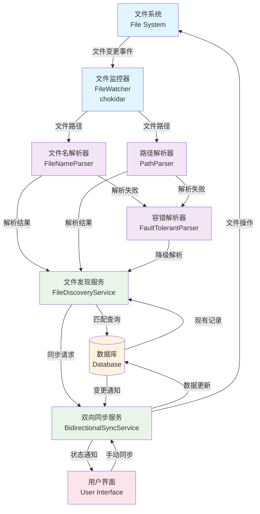
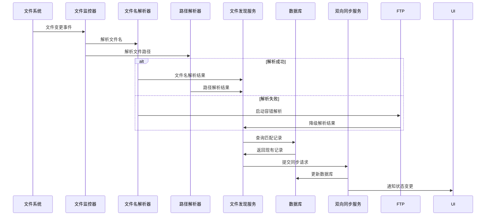
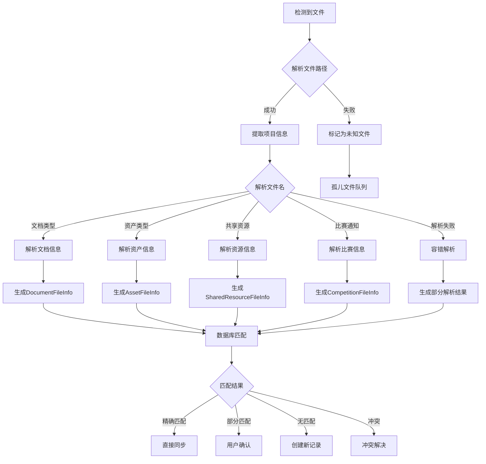
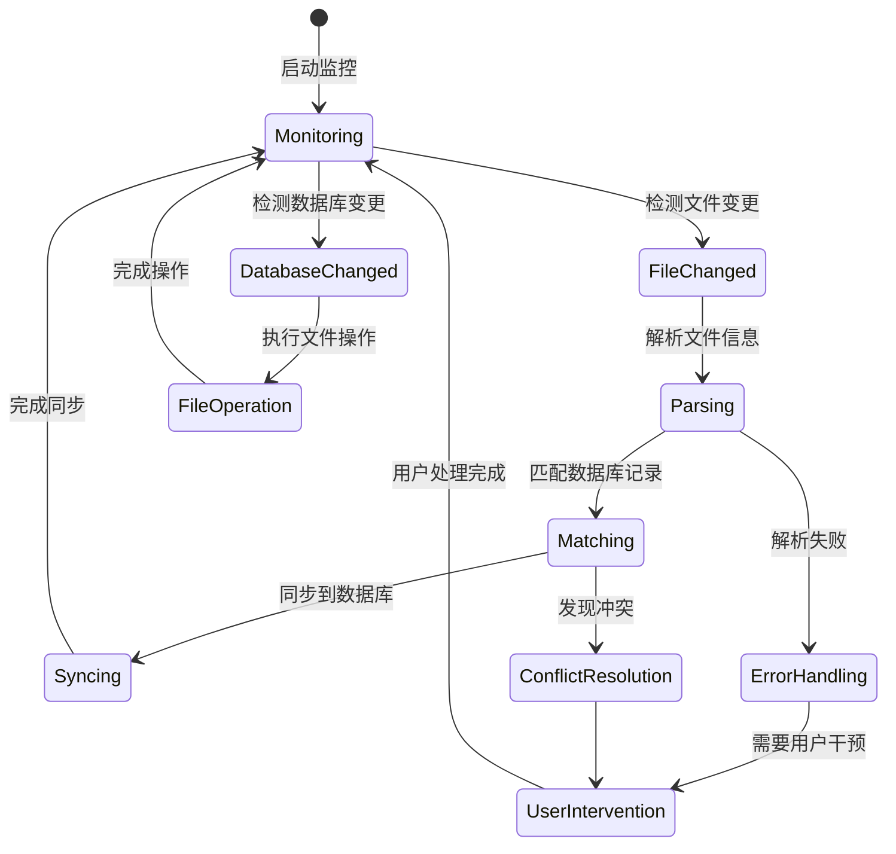

# RFC-001: 基于文件名解析的双向同步功能

**状态**: 修订版 (Revised)  
**作者**: ClarityFile 开发团队  
**创建日期**: 2025-01-18  
**最后更新**: 2025-06-18

## 摘要 (Abstract)

本RFC提出为ClarityFile项目实现基于文件名和路径解析的双向同步功能。该功能将允许用户直接在文件系统中操作文件（移动、重命名、删除等），同时保持与ClarityFile数据库的同步。通过解析标准化的文件名和路径结构，我们可以实现可靠的文件识别和关联，特别适用于网盘同步等场景。

## 修订说明 (Revision Notes)

**原方案问题**: 基于文件扩展属性（xattr）的方案在测试中发现，网盘服务（如百度网盘、阿里云盘等）会在文件上传下载过程中自动清理扩展属性，导致元数据丢失，同步机制完全失效。

**新方案优势**: 改为基于文件名模式识别的硬编码解析方式，完全不依赖文件元数据，确保在网盘同步场景下的可靠性和稳定性。

## 动机和背景 (Motivation & Background)

### 当前问题

ClarityFile当前采用单向同步架构：

```
Frontend → Backend → Database → File System
```

存在以下限制：

1. **用户无法直接操作文件系统** - 所有文件操作必须通过ClarityFile界面
2. **网盘同步兼容性差** - 扩展属性在网盘同步过程中会丢失
3. **缺乏灵活性** - 无法与其他文件管理工具协同工作
4. **用户体验受限** - 无法利用操作系统原生的文件管理功能

### 技术挑战

**扩展属性方案的致命缺陷**：

- 网盘服务（百度网盘、阿里云盘、OneDrive等）在文件上传时会清理扩展属性
- 从网盘下载的文件失去所有自定义元数据
- 跨平台兼容性复杂（Windows ADS、macOS/Linux xattr）
- 第三方软件可能意外清除扩展属性

### 目标

实现双向同步功能，使ClarityFile能够：

1. **检测文件系统变化** - 自动发现用户在文件系统中的操作
2. **保持数据一致性** - 确保数据库与文件系统状态同步
3. **网盘同步兼容** - 在网盘同步场景下保持文件识别能力
4. **利用现有命名规范** - 基于已建立的智能命名系统进行解析

## 详细设计 (Detailed Design)

### 核心架构

新的双向同步架构：

```
Frontend ↔ Backend ↔ Database ↔ File Discovery Service ↔ File System (standardized naming)
                    ↑
              File Watcher Service
                    ↑
            File Name Parser + Path Parser
```

### 文件名解析设计

#### 解析目标数据结构

```typescript
// 基础解析结果，继承现有的 FileImportContext 结构
interface ParsedFileInfo extends Partial<FileImportContext> {
  // 解析元信息
  confidence: number // 解析置信度 0-1
  extractedDate?: Date // 从文件名提取的日期
  errors: string[] // 解析错误
  warnings: string[] // 解析警告

  // 覆盖必需字段
  sourcePath: string // 等同于 filePath
  originalFileName: string // 原始文件名
  importType: 'document' | 'asset' | 'shared' | 'competition' | 'expense' | 'inbox'
}

// 特定类型的解析结果
interface DocumentFileInfo extends ParsedFileInfo {
  importType: 'document'
  // 文档特有字段（继承自 FileImportContext）
  logicalDocumentType: string
  versionTag: string
  isGenericVersion?: boolean
  competitionInfo?: {
    seriesName?: string
    levelName?: string
    projectName?: string
  }
}

interface AssetFileInfo extends ParsedFileInfo {
  importType: 'asset'
  // 资产特有字段
  assetType: string
  assetName: string
}

interface SharedResourceFileInfo extends ParsedFileInfo {
  importType: 'shared'
  // 共享资源特有字段
  resourceType: string
  resourceName: string
  customFields?: Record<string, any>
}

interface CompetitionFileInfo extends ParsedFileInfo {
  importType: 'competition'
  // 比赛特有字段
  seriesName: string
  levelName: string
  year?: number
}
```

#### 文件名解析模式

基于现有的 `IntelligentNamingService` 生成规则，建立反向解析模式：

**1. 文档版本文件名解析**

```typescript
// 模式：{documentTypeAbbr}_{versionTag}_{targetIdentifier}_{dateStr}.{ext}
// 示例：BP_国赛最终版V2_参赛作品名A_挑战杯国赛_20231026.pdf
const DOCUMENT_PATTERN = /^([A-Z]+)_(.+?)_(.+?)_(\d{8})\.([\w]+)$/

// 解析规则：
// - documentTypeAbbr: 通过 DOCUMENT_TYPE_ABBREVIATIONS 反向查找
// - versionTag: 版本标签
// - targetIdentifier: 通用/专用/比赛信息
// - dateStr: YYYYMMDD 格式日期
```

**2. 项目资产文件名解析**

```typescript
// 模式：{assetTypeAbbr}_{assetName}_{dateStr}.{ext}
// 示例：Screenshot_用户登录界面_20231001.png
const ASSET_PATTERN = /^([A-Za-z]+)_(.+?)_(\d{8})\.([\w]+)$/

// 解析规则：
// - assetTypeAbbr: 通过 ASSET_TYPE_ABBREVIATIONS 反向查找
// - assetName: 资产名称（截取前20字符）
// - dateStr: YYYYMMDD 格式日期
```

**3. 共享资源文件名解析**

```typescript
// 模式：{resourceTypePrefix}_{resourceName}_{customInfo}_{dateStr}.{ext}
// 示例：专利_一种新型AI算法_ZL2023X001_20231001.pdf
const SHARED_PATTERN = /^([^_]+)_(.+?)_(.+?)_(\d{8})\.([\w]+)$/

// 解析规则：
// - resourceTypePrefix: 资源类型前缀
// - resourceName: 资源名称
// - customInfo: 自定义字段信息（可选）
// - dateStr: YYYYMMDD 格式日期
```

**4. 比赛通知文件名解析**

```typescript
// 模式：通知_{competitionInfo}_{yearStr}.{ext}
// 示例：通知_挑战杯校赛_2024版.pdf
const COMPETITION_PATTERN = /^通知_(.+?)_(\d{4}版)\.([\w]+)$/

// 解析规则：
// - 固定前缀：通知
// - competitionInfo: 赛事缩写+赛段缩写
// - yearStr: YYYY版 格式年份
```

### 路径解析设计

**路径解析是文件分类的主要依据**。根据 DIRECTORY_DESIGN.md 的规范，文件的存放路径本身就包含了完整的分类信息，这比文件名解析更加可靠和准确。

#### 路径优先的解析策略

```typescript
// 解析优先级：路径解析 > 文件名解析 > 容错解析
class HybridParsingStrategy {
  static parseFile(filePath: string): ParsedFileInfo {
    // 1. 首先进行路径解析（主要分类依据）
    const pathInfo = PathParserService.parsePath(filePath)

    // 2. 然后进行文件名解析（补充详细信息）
    const fileName = path.basename(filePath)
    const fileNameInfo = FileNameParserService.parseFileName(fileName, filePath)

    // 3. 合并解析结果，路径信息优先
    return this.mergeParsingResults(pathInfo, fileNameInfo, filePath)
  }

  private static mergeParsingResults(
    pathInfo: PathInfo | null,
    fileNameInfo: ParsedFileInfo | null,
    filePath: string
  ): ParsedFileInfo {
    // 路径解析成功时，以路径信息为准
    if (pathInfo) {
      return {
        ...fileNameInfo,
        // 路径信息覆盖文件名解析结果
        importType: pathInfo.type,
        projectId: pathInfo.projectId,
        projectName: pathInfo.projectName,
        // 根据路径类型设置特定字段
        ...(pathInfo.type === 'asset' && { assetType: pathInfo.assetType }),
        ...(pathInfo.type === 'shared' && { resourceType: pathInfo.resourceType }),
        confidence: Math.max(0.8, fileNameInfo?.confidence || 0.5)
      }
    }

    // 路径解析失败时，依赖文件名解析
    return fileNameInfo || this.createFallbackInfo(filePath)
  }
}
```

基于 DIRECTORY_DESIGN.md 中的路径规范建立解析规则：

**1. 项目文档路径解析**

```typescript
// 路径模式：CLARITY_FILE_ROOT/Projects/{projectFolderName}/Documents/{logicalDocumentName}/
// 示例：/Projects/核心项目A_智慧校园助手_a1b2/Documents/商业计划书/
const PROJECT_DOC_PATH = /\/Projects\/(.+?)\/Documents\/(.+?)\//

// 解析规则：
// - projectFolderName格式：{projectName}_{shortProjectId}
// - 从项目文件夹名提取项目ID后缀
// - logicalDocumentName即为逻辑文档名称
// - 路径确定：importType = 'document'
```

**2. 项目资产路径解析**

```typescript
// 路径模式：CLARITY_FILE_ROOT/Projects/{projectFolderName}/_Assets/{assetType}/
// 示例：/Projects/核心项目A_a1b2/_Assets/软件截图/
const PROJECT_ASSET_PATH = /\/Projects\/(.+?)\/_Assets\/(.+?)\//

// 解析规则：
// - 同样从projectFolderName提取项目信息
// - assetType为资产类型目录名（直接从文件夹名获取）
// - 路径确定：importType = 'asset'
```

**3. 项目经费路径解析**

```typescript
// 路径模式：CLARITY_FILE_ROOT/Projects/{projectFolderName}/_Expenses/{expenseDescription}/
// 示例：/Projects/核心项目A_a1b2/_Expenses/购买打印机_张三_20240115/
const PROJECT_EXPENSE_PATH = /\/Projects\/(.+?)\/_Expenses\/(.+?)\//

// 解析规则：
// - 从projectFolderName提取项目信息
// - expenseDescription包含事项和申请人信息
// - 路径确定：importType = 'expense'
```

**4. 共享资源路径解析**

```typescript
// 路径模式：CLARITY_FILE_ROOT/SharedResources/{resourceType}/
// 示例：/SharedResources/专利成果/
const SHARED_RESOURCE_PATH = /\/SharedResources\/(.+?)\//

// 解析规则：
// - resourceType为资源类型目录名（直接确定资源类型）
// - 路径确定：importType = 'shared'
```

**5. 比赛资料路径解析**

```typescript
// 路径模式：CLARITY_FILE_ROOT/Competitions/{seriesName}/{levelName}/
// 示例：/Competitions/挑战杯/校级初赛/
const COMPETITION_PATH = /\/Competitions\/(.+?)\/(.+?)\//

// 解析规则：
// - seriesName为赛事系列名（直接从文件夹名获取）
// - levelName为赛段名称（直接从文件夹名获取）
// - 路径确定：importType = 'competition'
```

#### 路径解析的优势

1. **分类准确性高**：文件夹结构是强制性的，比文件名更可靠
2. **信息完整性好**：路径包含了层级关系和分类信息
3. **容错性强**：即使文件名不规范，路径仍能提供基本分类
4. **扩展性好**：新增文件类型只需要添加路径规则
5. **用户友好**：用户可以通过文件夹位置直观理解文件分类

### 核心服务架构

#### 服务组件设计

```typescript
/**
 * 文件名解析服务
 */
class FileNameParserService {
  static parseDocumentFileName(fileName: string): DocumentFileInfo | null
  static parseAssetFileName(fileName: string): AssetFileInfo | null
  static parseSharedResourceFileName(fileName: string): SharedResourceFileInfo | null
  static parseCompetitionFileName(fileName: string): CompetitionFileInfo | null

  // 通用解析入口
  static parseFileName(fileName: string, filePath: string): ParsedFileInfo | null
}

/**
 * 路径解析服务
 */
class PathParserService {
  static parseProjectPath(filePath: string): ProjectPathInfo | null
  static parseSharedResourcePath(filePath: string): SharedResourcePathInfo | null
  static parseCompetitionPath(filePath: string): CompetitionPathInfo | null

  // 通用路径解析入口
  static parsePath(filePath: string): PathInfo | null
}

/**
 * 文件发现和同步服务
 */
class FileDiscoveryService {
  async scanDirectory(rootPath: string): Promise<DiscoveredFile[]>
  async matchWithDatabase(discoveredFiles: DiscoveredFile[]): Promise<MatchResult[]>
  async syncToDatabase(matchResults: MatchResult[]): Promise<SyncResult[]>
  async handleOrphanedFiles(orphanedFiles: string[]): Promise<void>
  async resolveConflicts(conflicts: ConflictInfo[]): Promise<void>
}

/**
 * 双向同步协调器
 */
class BidirectionalSyncService {
  startFileWatcher(rootPath: string): void
  handleFileSystemChange(event: FileSystemEvent): Promise<void>
  handleDatabaseChange(event: DatabaseEvent): Promise<void>

  // 手动同步触发
  async performFullSync(): Promise<SyncReport>
  async performIncrementalSync(): Promise<SyncReport>
}
```

#### 核心流程架构图



上面的 Mermaid 图展示了整个双向同步系统的架构和数据流。

#### 详细流程说明

**1. 文件系统变更检测流程**



**2. 文件解析详细流程**



**3. 双向同步核心逻辑**



#### 关键流程实现细节

**A. 文件名解析流程**

1. **模式识别**：根据文件名前缀和格式识别文件类型
2. **正则匹配**：使用预定义的正则表达式提取关键信息
3. **缩写反查**：通过缩写映射表还原完整的类型名称
4. **置信度评分**：根据匹配程度计算解析置信度
5. **容错处理**：解析失败时启动降级策略

**B. 数据库匹配流程**

1. **主键匹配**：优先通过文件路径匹配现有的 `managed_files` 记录
2. **元数据匹配**：通过解析出的项目ID、文档类型等信息匹配
3. **模糊匹配**：使用文件名相似度算法进行模糊匹配
4. **冲突检测**：识别一对多或多对一的匹配冲突
5. **置信度排序**：按匹配置信度对结果进行排序

**C. 同步执行流程**

1. **事务开始**：开启数据库事务确保数据一致性
2. **记录创建/更新**：根据匹配结果创建或更新数据库记录
3. **关联建立**：建立文件与业务实体的关联关系
4. **索引更新**：更新内存索引以提高后续查询性能
5. **事务提交**：提交事务并通知相关服务

**D. 错误处理流程**

1. **解析错误**：记录错误信息，尝试部分解析
2. **匹配冲突**：标记冲突文件，等待用户处理
3. **同步失败**：回滚事务，记录失败原因
4. **用户通知**：通过UI显示错误状态和处理建议
5. **重试机制**：对临时性错误实施自动重试

**E. 性能优化策略**

1. **增量扫描**：只处理变更的文件，避免全量扫描
2. **批量处理**：将多个文件变更合并为批量操作
3. **异步执行**：解析和同步操作在后台异步执行
4. **缓存机制**：缓存解析结果和数据库查询结果
5. **索引优化**：维护内存索引加速文件查找

### 错误处理和容错机制

#### 解析失败处理策略

1. **降级解析**: 如果完整解析失败，尝试部分解析
2. **模糊匹配**: 通过文件名相似度匹配可能的记录
3. **用户确认**: 对于无法自动解析的文件，提供用户界面进行手动关联
4. **孤儿文件管理**: 建立孤儿文件队列，定期提醒用户处理
5. **解析日志**: 记录所有解析过程，便于调试和改进

#### 容错机制

```typescript
// 解析结果，与现有的 FileImportResult 保持一致的结构
interface ParseResult {
  success: boolean
  confidence: number // 0-1，解析置信度
  parsedInfo?: ParsedFileInfo // 主要解析结果
  fallbackInfo?: Partial<ParsedFileInfo> // 降级解析结果
  errors?: string[] // 解析错误
  warnings?: string[] // 解析警告
  suggestions?: string[] // 修复建议
}

// 文件匹配结果，用于与数据库记录关联
interface MatchResult {
  discoveredFile: ParsedFileInfo
  databaseRecord?: ManagedFileOutput // 使用现有的输出类型
  matchType: 'exact' | 'partial' | 'none' | 'conflict'
  confidence: number
  conflictReason?: string
}

// 同步结果，与现有的 FileImportResult 结构类似
interface SyncResult {
  success: boolean
  managedFileId?: string
  finalPath?: string
  relativePath?: string
  logicalDocumentId?: string
  documentVersionId?: string
  assetId?: string
  sharedResourceId?: string
  errors?: string[]
  warnings?: string[]
}

class FaultTolerantParser {
  // 多模式匹配
  static parseWithFallback(fileName: string, filePath: string): ParseResult

  // 正则表达式匹配（灵活匹配）
  static flexiblePatternMatch(fileName: string): ParseResult

  // 上下文推断（结合路径信息）
  static contextualInference(fileName: string, filePath: string): ParseResult

  // 数据库辅助解析
  static databaseAssistedParsing(fileName: string, existingRecords: ManagedFile[]): ParseResult
}
```

## 实现计划 (Implementation Plan)

### Phase 1: 解析引擎开发 (2周)

**目标**: 建立文件名和路径解析能力

**任务**:

- [ ] 实现 `FileNameParserService` 核心解析逻辑
- [ ] 实现 `PathParserService` 路径解析功能
- [ ] 建立缩写映射的反向查找表
- [ ] 实现正则表达式解析规则
- [ ] 单元测试覆盖所有解析场景
- [ ] 性能基准测试

**交付物**:

- 完整的文件名解析服务
- 路径解析服务
- 解析规则文档和测试报告

### Phase 2: 文件发现服务 (2周)

**目标**: 实现文件系统扫描和匹配逻辑

**任务**:

- [ ] 实现 `FileDiscoveryService` 文件扫描功能
- [ ] 建立文件与数据库记录的匹配算法
- [ ] 实现置信度评分系统
- [ ] 处理解析失败和边界情况
- [ ] 实现孤儿文件检测和管理
- [ ] 集成测试

**交付物**:

- 文件发现和匹配服务
- 置信度评分算法
- 孤儿文件处理机制

### Phase 3: 双向同步核心 (3周)

**目标**: 实现完整的双向同步功能

**任务**:

- [ ] 实现 `BidirectionalSyncService` 同步协调器
- [ ] 集成 chokidar 文件监控
- [ ] 实现数据库变更监听
- [ ] 建立冲突检测和解决机制
- [ ] 实现增量同步和全量同步
- [ ] 错误处理和恢复机制
- [ ] 性能优化

**交付物**:

- 完整的双向同步服务
- 冲突解决机制
- 同步性能报告

### Phase 4: 用户界面集成 (2周)

**目标**: 提供用户友好的同步管理界面

**任务**:

- [ ] 开发孤儿文件管理界面
- [ ] 实现手动文件关联功能
- [ ] 添加解析状态和进度显示
- [ ] 提供解析错误的用户反馈
- [ ] 实现同步日志查看
- [ ] 用户设置和配置选项

**交付物**:

- 同步管理用户界面
- 手动关联工具
- 用户操作指南

### Phase 5: 迁移和兼容性 (2周)

**目标**: 处理现有文件的迁移和系统兼容

**任务**:

- [ ] 开发现有文件的批量解析工具
- [ ] 实现与现有系统的兼容模式
- [ ] 数据迁移和验证工具
- [ ] 向后兼容性测试
- [ ] 迁移进度跟踪和回滚机制

**交付物**:

- 文件迁移工具
- 兼容性验证报告
- 迁移操作文档

### Phase 6: 测试和部署 (1周)

**目标**: 全面测试和生产部署

**任务**:

- [ ] 端到端集成测试
- [ ] 网盘同步场景专项测试
- [ ] 性能压力测试
- [ ] 用户验收测试
- [ ] 生产环境部署
- [ ] 监控和告警配置

**交付物**:

- 完整的测试报告
- 部署文档
- 运维监控方案

**总计**: 12周开发时间

## 风险评估 (Risk Assessment)

### 技术风险

#### 高风险

- **解析准确性**: 文件名解析可能存在歧义或错误
  - **缓解措施**: 多重验证、置信度评分、用户确认机制
  - **检测方式**: 解析结果与数据库记录的一致性检查

#### 中风险

- **用户行为依赖**: 依赖用户不手动修改文件名和路径

  - **缓解措施**: 用户教育、文件锁定、变更检测
  - **监控指标**: 非标准文件名的检测率

- **性能影响**: 大量文件的解析可能影响性能
  - **缓解措施**: 异步处理、增量扫描、缓存机制
  - **监控指标**: 解析时间、内存使用量

#### 低风险

- **命名规范演进**: 未来命名规范变化需要向后兼容
  - **缓解措施**: 版本化解析规则、渐进式升级
  - **测试覆盖**: 多版本命名格式的兼容性测试

### 业务风险

#### 中风险

- **用户学习成本**: 用户需要理解新的同步机制

  - **缓解措施**: 详细的用户文档、渐进式功能启用
  - **用户支持**: 在线帮助、常见问题解答

- **数据一致性**: 同步过程中可能出现数据不一致
  - **缓解措施**: 事务性操作、冲突检测、数据校验
  - **回滚计划**: 完整的数据恢复机制

#### 低风险

- **功能复杂性增加**: 系统复杂性增加可能影响维护
  - **缓解措施**: 良好的代码架构、充分的测试覆盖
  - **文档维护**: 详细的技术文档和API文档

## 备选方案对比 (Alternatives Comparison)

### 原方案 vs 新方案

| 维度             | 扩展属性方案    | 文件名解析方案    |
| ---------------- | --------------- | ----------------- |
| **网盘兼容性**   | ❌ 不兼容       | ✅ 完全兼容       |
| **跨平台一致性** | ⚠️ 复杂         | ✅ 一致           |
| **实现复杂度**   | 🔴 高           | 🟡 中等           |
| **用户可读性**   | ⚠️ 隐藏         | ✅ 可读           |
| **调试友好性**   | ⚠️ 困难         | ✅ 容易           |
| **维护成本**     | 🔴 高           | 🟢 低             |
| **可靠性**       | ⚠️ 依赖文件系统 | ✅ 基于标准化命名 |

### 决策理由

选择文件名解析方案的主要原因：

1. **网盘同步兼容性**: 这是最关键的技术要求
2. **实现简单性**: 不需要处理复杂的跨平台扩展属性
3. **用户友好性**: 文件名本身包含有意义的信息
4. **维护便利性**: 解析逻辑相对简单，便于调试和维护
5. **现有基础**: 可以直接利用已有的智能命名系统

## 向后兼容性 (Backward Compatibility)

### 现有文件处理

#### 自动解析迁移

- 启动时扫描现有的 `managed_files` 记录
- 根据现有文件路径和文件名进行解析
- 对于解析成功的文件，建立新的关联关系
- 对于解析失败的文件，标记为需要手动处理

#### 渐进式迁移

- 用户可选择立即迁移或渐进式迁移
- 渐进式迁移在文件被访问时进行解析
- 提供迁移进度跟踪和状态显示

#### 兼容模式

- 支持同时运行新旧两套系统
- 新导入文件使用标准化命名和解析系统
- 旧文件继续使用原有的路径关联方式
- 逐步迁移到纯解析系统

### API兼容性

- 现有API保持不变
- 新增文件解析相关的API端点
- 内部实现逐步切换到解析系统
- 提供解析状态查询接口

## 结论

基于文件名解析的双向同步功能将显著提升ClarityFile在网盘同步场景下的可靠性和用户体验。通过利用现有的智能命名系统，我们可以实现稳定的文件识别和关联，同时保持与现有系统的兼容性。

该方案的主要优势：

- **网盘兼容**: 完全不依赖文件元数据，适用于所有网盘服务
- **实现简单**: 基于现有命名规范，开发复杂度可控
- **用户友好**: 文件名具有可读性，便于用户理解
- **维护便利**: 解析逻辑透明，便于调试和优化

建议按照分阶段实施计划推进，优先实现核心解析功能，然后逐步完善用户界面和高级特性。

## 参考资料

- [ClarityFile DIRECTORY_DESIGN.md](../packages/desktop/DIRECTORY_DESIGN.md)
- [IntelligentNamingService 实现](../packages/desktop/src/main/services/intelligent/intelligent-naming.service.ts)
- [IntelligentPathGeneratorService 实现](../packages/desktop/src/main/services/intelligent/intelligent-path-generator.service.ts)
- [chokidar - File watching library](https://github.com/paulmillr/chokidar)
