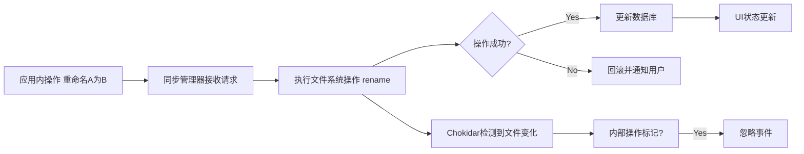
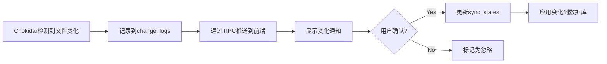
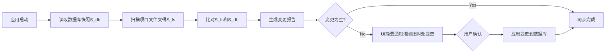
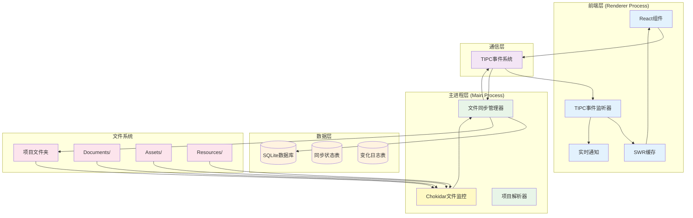
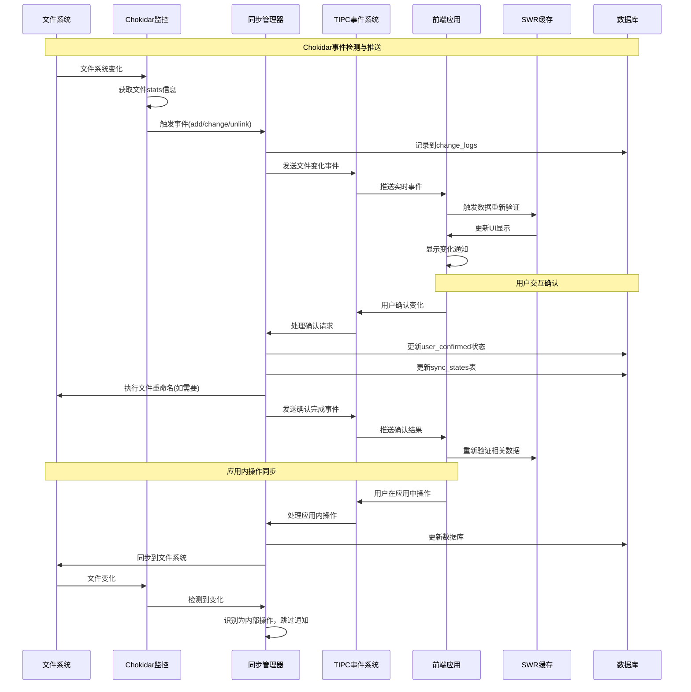

# RFC-001: 智能文件管理与双向同步系统

- **状态**: 修订版 v3 (Revised v3) - 基于Chokidar的简化架构
- **作者**: ClarityFile 开发团队
- **创建日期**: 2025-06-18
- **最后更新**: 2025-06-21
- **修订原因**: 采用Chokidar文件监控库，简化架构并移除冲突处理复杂性

## 概述

本RFC提出了一个基于Chokidar的智能文件管理与双向同步系统，旨在实现ClarityFile应用与项目文件夹之间的无缝同步。通过充分利用Chokidar的文件监控能力，系统将提供简洁高效的文件变化检测、用户确认机制和智能的项目结构解析功能。

## 背景与动机

### 当前痛点

1. **手动文件管理**：用户需要手动在应用中导入和管理文件
2. **文件夹与应用脱节**：项目文件夹的变化无法自动反映到应用中
3. **重复工作**：用户可能在文件夹中组织好文件，但还需要在应用中重新组织
4. **项目导入复杂**：新项目的导入需要大量手动操作

### 目标

1. **基于Chokidar的双向同步**：利用Chokidar强大的文件监控能力实现文件夹与应用数据库的实时双向同步
2. **简化的变化检测**：直接使用Chokidar事件(add/change/unlink等)，无需复杂的哈希计算
3. **自动导入**：选择工作目录后自动解析项目结构
4. **用户确认机制**：重要操作需要用户确认，保证数据安全
5. **TIPC+SWR集成**：Chokidar事件通过TIPC推送到前端，触发SWR自动重新验证

## 核心功能

### 1. 基于Chokidar的双向同步机制

系统通过Chokidar文件监控库，实现了应用与文件系统之间无缝、实时的双向数据同步。Chokidar提供了强大的跨平台文件监控能力，大大简化了我们的实现复杂度。

#### 1.1 数据流：从应用到文件系统 (App → FS)



#### 1.2 数据流：从文件系统到应用 (FS → App)


### 2. 智能项目结构解析

#### 2.1 目录结构识别

基于现有的目录设计规范，自动识别：

- Documents/ - 文档文件
- Assets/ - 项目资产
- Resources/ - 共享资源
- Exports/ - 导出文件
- Archive/ - 归档文件

#### 2.2 文件类型推断

- 基于文件扩展名推断资产类型
- 基于文件名模式推断文档类型
- 基于目录位置推断用途

#### 2.3 自动分类

- 文档自动分类为逻辑文档组
- 资产自动分类为不同资产类型
- 版本文件自动关联

### 3. 用户确认与交互

#### 3.1 实时变化通知

- Chokidar事件通过TIPC实时推送文件变化到前端
- 前端监听事件，自动触发SWR重新验证
- 利用Chokidar提供的文件stats信息展示变化详情
- 支持批量确认和单个确认
- 无需轮询，真正的实时响应

#### 3.2 简化的变化处理

为了专注于核心功能，暂时不实现复杂的冲突解决机制。系统采用简单的"用户确认"模式：



#### 3.3 自动重命名

- 确认后自动按照命名规范重命名文件
- 保持文件系统与数据库的一致性
- 利用Chokidar的add/unlink事件检测重命名操作

### 4. 性能与可扩展性考量

#### 4.1 Chokidar内置忽略机制

利用Chokidar的内置`ignored`选项，无需自己实现复杂的忽略逻辑：

```typescript
const watcher = chokidar.watch(projectPath, {
  ignored: (path, stats) => {
    // 忽略node_modules, .git等
    if (path.includes('node_modules') || path.includes('.git')) return true
    // 忽略临时文件
    if (stats?.isFile() && path.endsWith('.tmp')) return true
    // 支持.clarityignore文件的自定义规则
    return isIgnoredByRules(path)
  },
  persistent: true,
  awaitWriteFinish: true // 等待写入完成，避免部分写入的事件
})
```

#### 4.2 Chokidar内置防抖机制

Chokidar提供了`awaitWriteFinish`选项来处理分块写入，无需自己实现复杂的防抖逻辑：

```typescript
const watcher = chokidar.watch(projectPath, {
  awaitWriteFinish: {
    stabilityThreshold: 2000, // 文件稳定2秒后触发事件
    pollInterval: 100 // 每100ms检查一次
  },
  atomic: true // 处理原子写入操作
})
```

#### 4.3 简化的文件检测

- **利用Chokidar Stats**: 直接使用Chokidar提供的文件统计信息，无需手动计算哈希
- **事件驱动**: 完全基于Chokidar事件，无需轮询或手动扫描
- **首次索引**: 利用Chokidar的`ready`事件确定初始扫描完成

### 5. 健壮性与错误处理

#### 5.1 离线变更与追赶同步 (Offline Changes & Catch-up Sync)

当应用在离线后重启，它必须能智能地识别并处理此期间发生的所有文件变更。此"追赶同步"机制流程如下：



#### 5.2 事务性操作与回滚

- **原子性**: 复杂操作（如重命名文件夹）将被视为一个事务。如果操作中途失败（如磁盘空间不足、权限问题），系统将自动回滚到操作前的状态，避免数据不一致。
- **操作队列**: 所有文件操作将进入一个持久化队列，支持失败重试机制，以应对文件被临时占用等情况。

### 6. 安全与边界情况

#### 6.1 符号链接 (Symbolic Links) 处理

- **策略**: 默认情况下，系统将记录符号链接本身，但不会跟随它进入链接指向的目录。这可以防止无限循环扫描和潜在的安全风险。用户可在设置中更改此行为。

#### 6.2 文件系统权限

- **权限尊重**: 系统将读取并尊重文件的读/写权限。对于只读文件，应用内的编辑功能将被禁用。

#### 6.3 沙箱化操作

- **范围限制**: 所有文件操作将严格限制在用户选定的项目工作目录内，防止任何意外操作影响到目录之外的文件系统。

## 技术架构

### 基于Chokidar的简化架构图



### 基于Chokidar的双向同步流程图



### 1. 基于Chokidar的TIPC事件系统接口

```typescript
// 主进程向渲染进程发送的事件类型
export type RendererHandlers = {
  fileChanged: (data: {
    projectId: string
    chokidarEvent: 'add' | 'change' | 'unlink' | 'addDir' | 'unlinkDir'
    filePath: string
    stats?: fs.Stats // Chokidar提供的文件统计信息
  }) => void
  syncStateUpdated: (data: { projectId: string; syncStates: SyncState[] }) => void
}

// Chokidar文件监控服务
interface ChokidarWatcherService {
  startWatching(projectId: string, folderPath: string): Promise<void>
  stopWatching(projectId: string): Promise<void>
  // 直接使用Chokidar事件: 'add', 'change', 'unlink', 'addDir', 'unlinkDir', 'ready', 'error'
}
```

### 2. 简化的同步管理器

```typescript
interface FileSyncManager {
  startProjectWatching(projectId: string): Promise<void>
  stopProjectWatching(projectId: string): Promise<void>
  startAllProjectWatching(): Promise<void>

  // Chokidar事件处理
  private handleChokidarEvent(
    projectId: string,
    event: string,
    path: string,
    stats?: fs.Stats
  ): Promise<void>
  private sendEventToRenderer(eventName: string, data: any): void
}
```

### 3. 前端事件监听器

```typescript
// 前端监听TIPC事件
const handlers = createEventHandlers<RendererHandlers>({
  on: window.electron.ipcRenderer.on,
  send: window.ipcRenderer.send
})

// React Hook示例
function useFileSyncEvents(projectId: string) {
  useEffect(() => {
    const unlisten = handlers.fileChanged.listen((data) => {
      if (data.projectId === projectId) {
        // 触发SWR重新验证
        mutate(['project-sync-states', projectId])
        mutate(['project-change-logs', projectId])

        // 显示通知，包含Chokidar提供的详细信息
        showFileChangeNotification({
          event: data.chokidarEvent,
          path: data.filePath,
          size: data.stats?.size,
          modified: data.stats?.mtime
        })
      }
    })
    return unlisten
  }, [projectId])
}
```

### 4. SWR集成模式

```typescript
// 自动重新验证的Hook
export function useProjectSyncStates(projectId: string) {
  const { data, mutate } = useSWR(['project-sync-states', projectId], () =>
    tipcClient.getProjectSyncStates({ projectId })
  )

  // 监听实时事件
  useEffect(() => {
    const unlisten = handlers.syncStateUpdated.listen((eventData) => {
      if (eventData.projectId === projectId) {
        mutate() // 自动重新验证
      }
    })
    return unlisten
  }, [projectId, mutate])

  return { data, mutate }
}
```

## 数据模型扩展

### 1. 简化的同步状态跟踪

```sql
CREATE TABLE sync_states (
  id TEXT PRIMARY KEY,
  project_id TEXT NOT NULL REFERENCES projects(id),
  file_path TEXT NOT NULL,
  last_sync_timestamp INTEGER,
  sync_status TEXT NOT NULL, -- 'synced', 'pending', 'ignored' (移除conflict)
  file_size INTEGER, -- 来自Chokidar stats
  last_modified INTEGER, -- 来自Chokidar stats
  created_at INTEGER NOT NULL,
  updated_at INTEGER NOT NULL
);
```

### 2. 基于Chokidar的变化日志

```sql
CREATE TABLE change_logs (
  id TEXT PRIMARY KEY,
  project_id TEXT NOT NULL REFERENCES projects(id),
  change_type TEXT NOT NULL, -- 映射的变化类型
  file_path TEXT NOT NULL,
  file_size INTEGER, -- 直接来自Chokidar stats
  user_confirmed BOOLEAN DEFAULT FALSE,
  applied_at INTEGER,
  chokidar_event TEXT NOT NULL, -- 原始Chokidar事件: 'add', 'change', 'unlink'等
  metadata TEXT, -- JSON格式，存储Chokidar提供的额外信息
  created_at INTEGER NOT NULL
);
```

## 实现阶段

### Phase 1: Chokidar集成与基础监控 (1.5周)

- ✅ 数据模型扩展 (简化的sync_states, change_logs表)
- 🔄 Chokidar文件监控服务集成
- 🔄 TIPC事件系统集成
- 🔄 前端事件监听器实现
- 🔄 基础的用户确认流程

### Phase 2: 双向同步与SWR集成 (2周)

- 完整的Chokidar事件处理
- 前端SWR自动重新验证机制
- 用户确认流程完善
- 实时通知系统
- 内部操作标记机制

### Phase 3: 智能解析与用户体验 (3周)

- 项目结构解析
- 自动分类算法
- 导入计划生成
- 用户界面优化
- 通知系统完善

### Phase 4: 高级功能与性能优化 (2周)

- 批量操作支持
- Chokidar高级选项配置 (awaitWriteFinish, atomic等)
- 错误恢复机制
- 跨平台兼容性测试

## 风险与挑战

### 技术风险

1. **性能问题**：大量文件监控可能影响性能
   - **缓解**：事件防抖、智能过滤、批量处理
2. **事件风暴**：频繁的TIPC事件可能影响性能
   - **缓解**：事件聚合、防抖机制、优先级队列
3. **文件锁定**：文件被其他程序占用时的处理
   - **缓解**：重试机制、错误恢复、用户提示
4. **跨平台兼容性**：不同操作系统的文件系统差异
   - **缓解**：平台特定适配、充分测试

### 用户体验风险

1. **过度通知**：频繁的变化通知可能干扰用户
   - **缓解**：智能聚合、用户设置、通知优先级
2. **数据丢失**：同步错误可能导致数据丢失
   - **缓解**：事务性操作、自动备份、操作日志
3. **学习成本**：新功能的学习成本
   - **缓解**：渐进式引导、智能默认、帮助文档

### 缓解策略

1. **事件驱动优势**：实时响应，避免轮询开销
2. **增量实现**：分阶段实现，每个阶段都是可用状态
3. **用户控制**：提供详细的设置选项
4. **备份机制**：重要操作前自动备份
5. **回滚功能**：支持操作回滚
6. **性能监控**：实时监控事件处理性能

## 未来扩展

1. **云同步集成**：与云存储服务集成
2. **协作功能**：多用户协作时的同步
3. **版本控制**：集成Git等版本控制系统
4. **AI辅助**：使用AI进行更智能的文件分类

## 结论

基于Chokidar的智能文件管理与双向同步系统将显著提升ClarityFile的用户体验，实现真正的实时同步。通过充分利用Chokidar的强大文件监控能力，系统架构得到了大幅简化，同时保持了高性能和可靠性。

### 关键优势

1. **简化的架构**：利用Chokidar成熟的文件监控能力，减少自研复杂度
2. **真正的实时同步**：基于Chokidar事件推送，无延迟响应
3. **高性能**：Chokidar内置防抖、忽略机制，避免性能问题
4. **跨平台兼容**：Chokidar处理了不同操作系统的文件系统差异
5. **类型安全**：TIPC提供端到端类型安全
6. **SWR集成**：自动缓存管理和数据重新验证
7. **开发效率**：减少开发时间，专注于业务逻辑

### Chokidar带来的具体好处

1. **内置忽略机制**：无需自己实现.clarityignore解析
2. **原子写入检测**：自动处理分块写入和原子操作
3. **文件统计信息**：直接获取文件大小、修改时间等
4. **错误处理**：成熟的错误处理和恢复机制
5. **性能优化**：经过大量项目验证的性能优化

通过分阶段实现和充分的用户测试，可以确保系统的稳定性和可用性。基于Chokidar的简化架构使得Phase 1的实现时间可以缩短到1.5周，为后续功能奠定了更坚实的基础。
