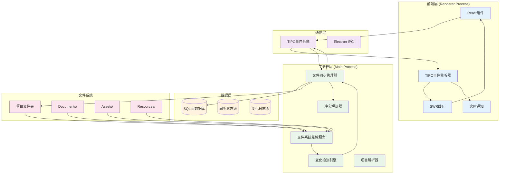
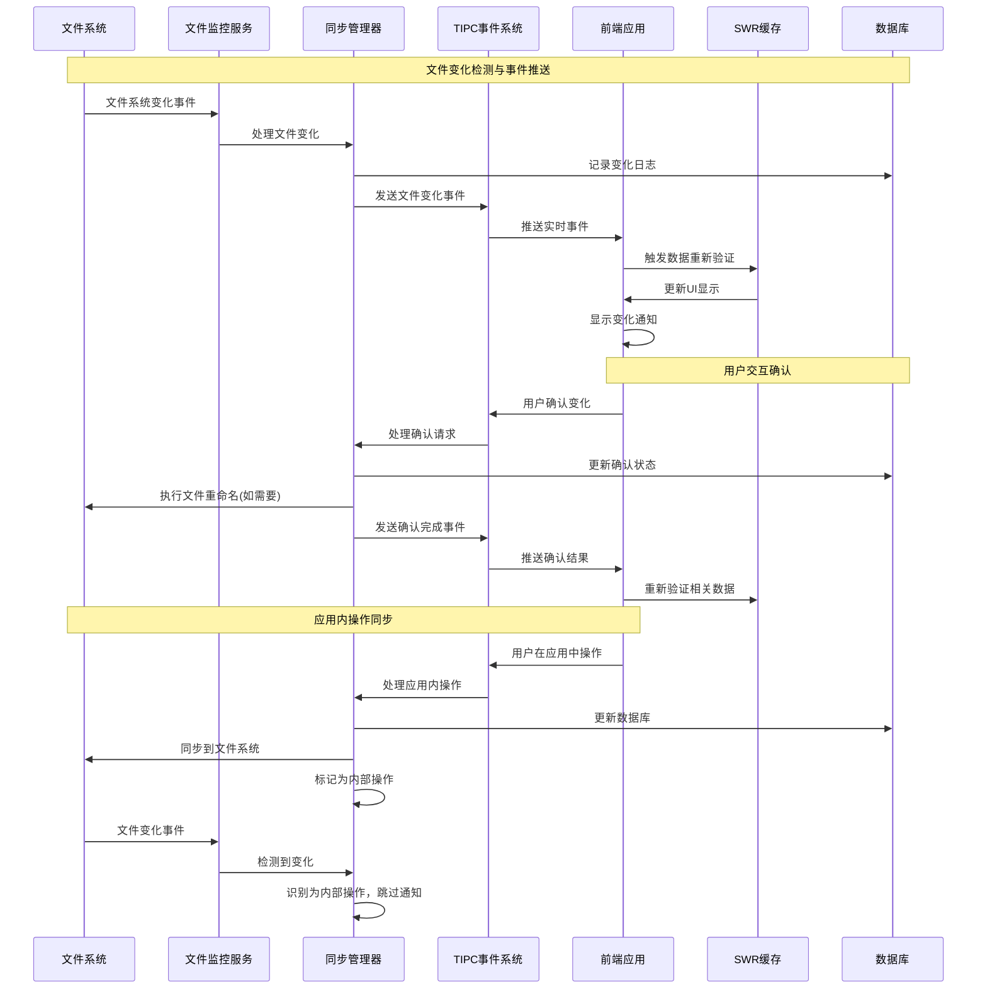

# RFC-001: 智能文件管理与双向同步系统

- **状态**: 修订版 v2 (Revised v2) - 采用TIPC事件驱动架构
- **作者**: ClarityFile 开发团队
- **创建日期**: 2025-06-18
- **最后更新**: 2025-06-19
- **修订原因**: 采用TIPC事件系统替代轮询机制，实现真正的实时同步

## 概述

本RFC提出了一个智能文件管理与双向同步系统，旨在实现ClarityFile应用与项目文件夹之间的无缝同步，自动检测文件变化，并提供智能的项目结构解析和导入功能。

## 背景与动机

### 当前痛点

1. **手动文件管理**：用户需要手动在应用中导入和管理文件
2. **文件夹与应用脱节**：项目文件夹的变化无法自动反映到应用中
3. **重复工作**：用户可能在文件夹中组织好文件，但还需要在应用中重新组织
4. **项目导入复杂**：新项目的导入需要大量手动操作

### 目标

1. **事件驱动的双向同步**：基于TIPC事件系统实现文件夹与应用数据库的实时双向同步
2. **实时智能检测**：自动检测文件夹变化并通过事件立即推送到前端
3. **自动导入**：选择工作目录后自动解析项目结构
4. **用户确认机制**：重要操作需要用户确认，保证数据安全
5. **SWR集成**：事件触发自动重新验证，避免手动状态管理

## 核心功能

### 1. 双向同步机制

#### 1.1 文件夹监控

- 监控项目文件夹的文件系统变化
- 检测新增、删除、移动、重命名操作
- 支持深度目录监控

#### 1.2 变化检测

- 文件内容变化检测
- 目录结构变化检测
- 文件元数据变化检测

#### 1.3 事件驱动同步策略

- **应用到文件夹**：应用中的重命名操作同步到文件系统，标记为内部操作避免重复通知
- **文件夹到应用**：文件夹变化通过TIPC事件实时推送到前端，触发SWR重新验证
- **实时通知**：变化事件立即推送，用户可实时看到文件状态更新
- **智能去重**：识别内部操作，避免循环通知

### 2. 智能项目结构解析

#### 2.1 目录结构识别

基于现有的目录设计规范，自动识别：

- Documents/ - 文档文件
- Assets/ - 项目资产
- Resources/ - 共享资源
- Exports/ - 导出文件
- Archive/ - 归档文件

#### 2.2 文件类型推断

- 基于文件扩展名推断资产类型
- 基于文件名模式推断文档类型
- 基于目录位置推断用途

#### 2.3 自动分类

- 文档自动分类为逻辑文档组
- 资产自动分类为不同资产类型
- 版本文件自动关联

### 3. 用户确认与交互

#### 3.1 实时变化通知

- 通过TIPC事件实时推送文件变化到前端
- 前端监听事件，自动触发SWR重新验证
- 提供变化详情和预览
- 支持批量确认和单个确认
- 无需轮询，真正的实时响应

#### 3.2 冲突解决

- 文件名冲突处理
- 数据不一致解决
- 用户选择优先级

#### 3.3 自动重命名

- 确认后自动按照命名规范重命名文件
- 保持文件系统与数据库的一致性

## 技术架构

### 事件驱动系统架构图



### 事件驱动的双向同步流程图



### 1. TIPC事件系统接口

```typescript
// 主进程向渲染进程发送的事件类型
export type RendererHandlers = {
  fileChanged: (data: {
    projectId: string
    changeEvent: FileChangeEvent
    fileInfo?: FileInfo
  }) => void
  syncStateUpdated: (data: { projectId: string; syncStates: SyncState[] }) => void
  conflictDetected: (data: { projectId: string; conflicts: FileConflict[] }) => void
}

// 文件系统监控服务
interface FileSystemWatcherService extends EventEmitter {
  startWatching(projectId: string, folderPath: string): Promise<void>
  stopWatching(projectId: string, folderPath: string): Promise<void>
  // 事件: 'fileChange', 'initialScan', 'error'
}
```

### 2. 事件驱动同步管理器

```typescript
interface FileSyncManager {
  startProjectWatching(projectId: string): Promise<void>
  stopProjectWatching(projectId: string): Promise<void>
  startAllProjectWatching(): Promise<void>

  // 内部事件处理
  private handleFileChange(projectId: string, changeEvent: FileChangeEvent): Promise<void>
  private sendEventToRenderer(eventName: string, data: any): void
}
```

### 3. 前端事件监听器

```typescript
// 前端监听TIPC事件
const handlers = createEventHandlers<RendererHandlers>({
  on: window.electron.ipcRenderer.on,
  send: window.ipcRenderer.send
})

// React Hook示例
function useFileSyncEvents(projectId: string) {
  useEffect(() => {
    const unlisten = handlers.fileChanged.listen((data) => {
      if (data.projectId === projectId) {
        // 触发SWR重新验证
        mutate(['project-sync-states', projectId])
        mutate(['project-change-logs', projectId])

        // 显示通知
        showFileChangeNotification(data)
      }
    })
    return unlisten
  }, [projectId])
}
```

### 4. SWR集成模式

```typescript
// 自动重新验证的Hook
export function useProjectSyncStates(projectId: string) {
  const { data, mutate } = useSWR(['project-sync-states', projectId], () =>
    tipcClient.getProjectSyncStates({ projectId })
  )

  // 监听实时事件
  useEffect(() => {
    const unlisten = handlers.syncStateUpdated.listen((eventData) => {
      if (eventData.projectId === projectId) {
        mutate() // 自动重新验证
      }
    })
    return unlisten
  }, [projectId, mutate])

  return { data, mutate }
}
```

## 数据模型扩展

### 1. 同步状态跟踪

```sql
CREATE TABLE sync_states (
  id TEXT PRIMARY KEY,
  project_id TEXT NOT NULL REFERENCES projects(id),
  file_path TEXT NOT NULL,
  last_sync_hash TEXT,
  last_sync_timestamp INTEGER,
  sync_status TEXT NOT NULL, -- 'synced', 'pending', 'conflict'
  created_at INTEGER NOT NULL,
  updated_at INTEGER NOT NULL
);
```

### 2. 变化日志

```sql
CREATE TABLE change_logs (
  id TEXT PRIMARY KEY,
  project_id TEXT NOT NULL REFERENCES projects(id),
  change_type TEXT NOT NULL, -- 'file_added', 'file_removed', 'file_modified'
  file_path TEXT NOT NULL,
  old_value TEXT,
  new_value TEXT,
  user_confirmed BOOLEAN DEFAULT FALSE,
  applied_at INTEGER,
  created_at INTEGER NOT NULL
);
```

## 实现阶段

### Phase 1: 基础监控与事件系统 (2周)

- ✅ 实现文件系统监控服务 (FileSystemWatcherService)
- ✅ 基础变化检测引擎 (ChangeDetector)
- ✅ 数据模型扩展 (sync_states, change_logs表)
- 🔄 TIPC事件系统集成
- 🔄 前端事件监听器实现

### Phase 2: 双向同步与SWR集成 (3周)

- 完整的事件驱动同步引擎
- 前端SWR自动重新验证机制
- 冲突解决机制
- 用户确认流程
- 实时通知系统

### Phase 3: 智能解析与用户体验 (4周)

- 项目结构解析
- 自动分类算法
- 导入计划生成
- 用户界面优化
- 通知系统完善

### Phase 4: 高级功能与性能优化 (3周)

- 批量操作支持
- 性能优化 (事件防抖、智能缓存)
- 错误恢复机制
- 跨平台兼容性测试

## 风险与挑战

### 技术风险

1. **性能问题**：大量文件监控可能影响性能
   - **缓解**：事件防抖、智能过滤、批量处理
2. **事件风暴**：频繁的TIPC事件可能影响性能
   - **缓解**：事件聚合、防抖机制、优先级队列
3. **文件锁定**：文件被其他程序占用时的处理
   - **缓解**：重试机制、错误恢复、用户提示
4. **跨平台兼容性**：不同操作系统的文件系统差异
   - **缓解**：平台特定适配、充分测试

### 用户体验风险

1. **过度通知**：频繁的变化通知可能干扰用户
   - **缓解**：智能聚合、用户设置、通知优先级
2. **数据丢失**：同步错误可能导致数据丢失
   - **缓解**：事务性操作、自动备份、操作日志
3. **学习成本**：新功能的学习成本
   - **缓解**：渐进式引导、智能默认、帮助文档

### 缓解策略

1. **事件驱动优势**：实时响应，避免轮询开销
2. **增量实现**：分阶段实现，每个阶段都是可用状态
3. **用户控制**：提供详细的设置选项
4. **备份机制**：重要操作前自动备份
5. **回滚功能**：支持操作回滚
6. **性能监控**：实时监控事件处理性能

## 成功指标

1. **同步准确性**：99%以上的文件变化正确同步
2. **实时响应**：文件变化事件推送延迟小于1秒
3. **事件处理性能**：单个事件处理时间小于100ms
4. **用户满意度**：用户反馈评分4.5+/5.0
5. **错误率**：同步错误率低于1%
6. **事件可靠性**：事件传递成功率99.9%以上

## 未来扩展

1. **云同步集成**：与云存储服务集成
2. **协作功能**：多用户协作时的同步
3. **版本控制**：集成Git等版本控制系统
4. **AI辅助**：使用AI进行更智能的文件分类

## 结论

基于TIPC事件系统的智能文件管理与双向同步系统将显著提升ClarityFile的用户体验，实现真正的实时同步。通过事件驱动架构，避免了轮询的性能开销，提供了更好的响应性和用户体验。

### 关键优势

1. **真正的实时同步**：基于事件推送，无延迟响应
2. **高性能**：避免轮询开销，事件驱动更高效
3. **类型安全**：TIPC提供端到端类型安全
4. **SWR集成**：自动缓存管理和数据重新验证
5. **可扩展性**：事件系统易于扩展新功能

通过分阶段实现和充分的用户测试，可以确保系统的稳定性和可用性。当前Phase 1的基础架构已经完成，为后续功能奠定了坚实基础。
