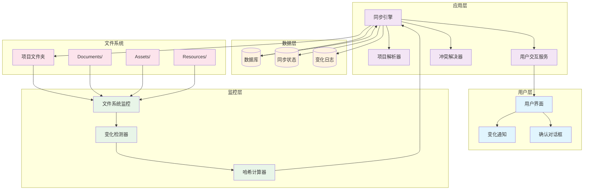
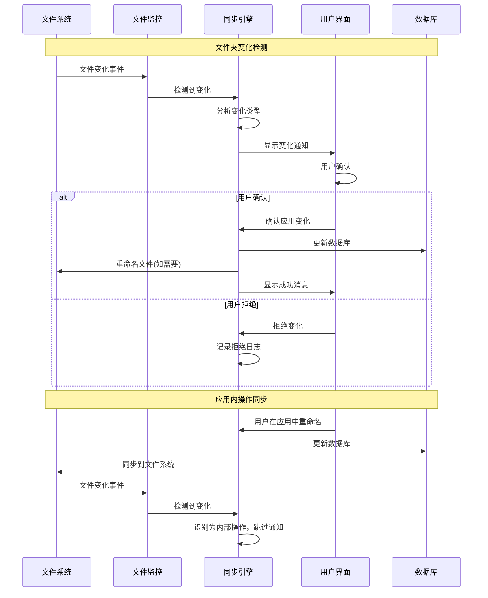

# RFC-001: 智能文件管理与双向同步系统

- **状态**: 修订版 (Revised)
- **作者**: ClarityFile 开发团队
- **创建日期**: 2025-06-18
- **最后更新**: 2025-06-19

## 概述

本RFC提出了一个智能文件管理与双向同步系统，旨在实现ClarityFile应用与项目文件夹之间的无缝同步，自动检测文件变化，并提供智能的项目结构解析和导入功能。

## 背景与动机

### 当前痛点

1. **手动文件管理**：用户需要手动在应用中导入和管理文件
2. **文件夹与应用脱节**：项目文件夹的变化无法自动反映到应用中
3. **重复工作**：用户可能在文件夹中组织好文件，但还需要在应用中重新组织
4. **项目导入复杂**：新项目的导入需要大量手动操作

### 目标

1. **双向同步**：实现文件夹与应用数据库的双向同步
2. **智能检测**：自动检测文件夹变化并提醒用户
3. **自动导入**：选择工作目录后自动解析项目结构
4. **用户确认机制**：重要操作需要用户确认，保证数据安全

## 核心功能

### 1. 双向同步机制

#### 1.1 文件夹监控

- 监控项目文件夹的文件系统变化
- 检测新增、删除、移动、重命名操作
- 支持深度目录监控

#### 1.2 变化检测

- 文件内容变化检测
- 目录结构变化检测
- 文件元数据变化检测

#### 1.3 同步策略

- **应用到文件夹**：应用中的重命名操作同步到文件系统
- **文件夹到应用**：文件夹变化提醒用户确认后同步到数据库

### 2. 智能项目结构解析

#### 2.1 目录结构识别

基于现有的目录设计规范，自动识别：

- Documents/ - 文档文件
- Assets/ - 项目资产
- Resources/ - 共享资源
- Exports/ - 导出文件
- Archive/ - 归档文件

#### 2.2 文件类型推断

- 基于文件扩展名推断资产类型
- 基于文件名模式推断文档类型
- 基于目录位置推断用途

#### 2.3 自动分类

- 文档自动分类为逻辑文档组
- 资产自动分类为不同资产类型
- 版本文件自动关联

### 3. 用户确认与交互

#### 3.1 变化通知

- 检测到文件夹变化时显示通知
- 提供变化详情和预览
- 支持批量确认和单个确认

#### 3.2 冲突解决

- 文件名冲突处理
- 数据不一致解决
- 用户选择优先级

#### 3.3 自动重命名

- 确认后自动按照命名规范重命名文件
- 保持文件系统与数据库的一致性

## 技术架构

### 系统架构图



### 双向同步流程图



### 1. 文件系统监控层

```typescript
interface FileSystemWatcher {
  watchDirectory(path: string): void
  onFileAdded(callback: (file: FileInfo) => void): void
  onFileRemoved(callback: (file: FileInfo) => void): void
  onFileModified(callback: (file: FileInfo) => void): void
  onDirectoryChanged(callback: (dir: DirectoryInfo) => void): void
}
```

### 2. 同步引擎

```typescript
interface SyncEngine {
  detectChanges(): Promise<ChangeSet>
  applyChanges(changes: ChangeSet): Promise<SyncResult>
  resolveConflicts(conflicts: Conflict[]): Promise<Resolution[]>
}
```

### 3. 项目解析器

```typescript
interface ProjectParser {
  parseProjectStructure(rootPath: string): Promise<ProjectStructure>
  inferDocumentTypes(files: FileInfo[]): DocumentTypeMapping[]
  inferAssetTypes(files: FileInfo[]): AssetTypeMapping[]
  generateImportPlan(structure: ProjectStructure): ImportPlan
}
```

### 4. 用户交互层

```typescript
interface UserInteractionService {
  showChangeNotification(changes: ChangeSet): Promise<UserDecision>
  showConflictResolution(conflicts: Conflict[]): Promise<Resolution[]>
  showImportConfirmation(plan: ImportPlan): Promise<boolean>
}
```

## 数据模型扩展

### 1. 同步状态跟踪

```sql
CREATE TABLE sync_states (
  id TEXT PRIMARY KEY,
  project_id TEXT NOT NULL REFERENCES projects(id),
  file_path TEXT NOT NULL,
  last_sync_hash TEXT,
  last_sync_timestamp INTEGER,
  sync_status TEXT NOT NULL, -- 'synced', 'pending', 'conflict'
  created_at INTEGER NOT NULL,
  updated_at INTEGER NOT NULL
);
```

### 2. 变化日志

```sql
CREATE TABLE change_logs (
  id TEXT PRIMARY KEY,
  project_id TEXT NOT NULL REFERENCES projects(id),
  change_type TEXT NOT NULL, -- 'file_added', 'file_removed', 'file_modified'
  file_path TEXT NOT NULL,
  old_value TEXT,
  new_value TEXT,
  user_confirmed BOOLEAN DEFAULT FALSE,
  applied_at INTEGER,
  created_at INTEGER NOT NULL
);
```

## 实现阶段

### Phase 1: 基础监控 (2周)

- 实现文件系统监控
- 基础变化检测
- 简单通知机制

### Phase 2: 双向同步 (3周)

- 完整同步引擎
- 冲突解决机制
- 用户确认流程

### Phase 3: 智能解析 (4周)

- 项目结构解析
- 自动分类算法
- 导入计划生成

### Phase 4: 高级功能 (3周)

- 批量操作
- 性能优化
- 错误恢复

## 风险与挑战

### 技术风险

1. **性能问题**：大量文件监控可能影响性能
2. **文件锁定**：文件被其他程序占用时的处理
3. **跨平台兼容性**：不同操作系统的文件系统差异

### 用户体验风险

1. **过度通知**：频繁的变化通知可能干扰用户
2. **数据丢失**：同步错误可能导致数据丢失
3. **学习成本**：新功能的学习成本

### 缓解策略

1. **增量实现**：分阶段实现，每个阶段都是可用状态
2. **用户控制**：提供详细的设置选项
3. **备份机制**：重要操作前自动备份
4. **回滚功能**：支持操作回滚

## 成功指标

1. **同步准确性**：99%以上的文件变化正确同步
2. **响应时间**：文件变化检测延迟小于5秒
3. **用户满意度**：用户反馈评分4.5+/5.0
4. **错误率**：同步错误率低于1%

## 未来扩展

1. **云同步集成**：与云存储服务集成
2. **协作功能**：多用户协作时的同步
3. **版本控制**：集成Git等版本控制系统
4. **AI辅助**：使用AI进行更智能的文件分类

## 结论

智能文件管理与双向同步系统将显著提升ClarityFile的用户体验，减少手动操作，提高工作效率。通过分阶段实现和充分的用户测试，可以确保系统的稳定性和可用性。
